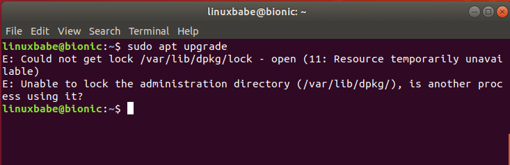
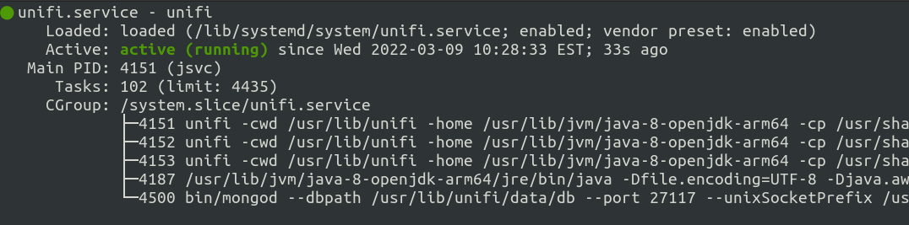

# Purpose
Use Ansible to Install UniFi Controller on Raspberry Pi4  

## Setup
The following steps can be categorized into two parts:
- Provision a Raspberry Pi4 to accept the Ansible playbook
- Install UniFi Network application on the Pi4  

There is also a playbook to update UifFi Network software  
I modeled the ansible playbook from this excellent guide:

[Step-By-Step Tutorial Raspberry Pi with Unifi Controller](https://community.ui.com/questions/Step-By-Step-Tutorial-Guide-Raspberry-Pi-with-UniFi-Controller-and-Pi-hole-from-scratch-headless/e8a24143-bfb8-4a61-973d-0b55320101dc)

## Download Ubuntu Server for Raspberry Pi

Navigate to:

https://ubuntu.com/download/raspberry-pi

And download the Ubuntu Server 20.04 image for the Pi
- FYI this also works if you use Ubunutu or Raspbian(with small changes)


To flash SD card, I use Balena Etcher  

  


After the SD card is flashed, add blank file called 'ssh' to Boot partition

```bash
fred@pop-os:/media/fred/boot$ touch ssh
```

Install SD card in Pi, connect network cable and power

## Grab IP address
Using your favorite application, find the IP address of the new Pi--I use pfSense so for me it's under the DHCP leases tab

There you will find a device named 'ubuntu'.  Make note of the IP address

For the purpose of this example, our IP was found to be 192.168.1.11

## SSH into the device

```bash
ssh ubuntu@192.168.1.11
```
When prompted for a password the default is 'ubuntu'

You will be required to change the password

Log in again using the new password and update the OS

```bash
sudo apt update
```

It will most likely take a while for the upgrade process to proceed as Ubuntu ships with "Unattended Upgrades" enabled.  Unattended Upgrades is a process where Ubuntu will automatically apply security patches.  It starts this process very soon after the system is online.  We have to wait for it to complete for us to be able to update our system.  If we try to do the "sudo apt dist-upgrade" too early we are met with:



Or something like this.  

It has been my experience that when checking for updates:

```bash
sudo apt update
```

We can finally update the OS when the number of packages needing updating is less than 54 or so.  


```bash
sudo apt dist-upgrade -y && sudo apt autoremove -y && sudo apt autoclean -y
```

## Update Pi and change some parameters
For this step I copy and paste the bootstrap.sh file  
This configures the new device with a new name 'unifi_pi' and adds user 'ansible'  
Run the script as root
```bash
sudo su
```  
```bash
nano bootstrap.sh
```
After I copy the contents of [bootstrap.sh](files/bootstrap.sh) into the new file, I save it then to make it executable:
```bash
chmod +x bootstrap.sh
```
Then run the script
```bash
./bootstrap.sh
```
At the end of the script, the device is rebooted to apply the changes


## Install Unifi with Ansible Locally

My preferred method of installing playbooks is from a local repository to the devices. It is possible to clone the repository to the device we want to configure but it involves a handful of steps:
- install git
- install Ansible
- install python packages pip and python-dev

on the device we're configuring. We're not going to do that here.


## Reconnect to the Pi
This time connect as the new user 'ansible'
```bash
ssh ansible@192.168.1.11
```

## Clone the Repository

```bash
git clone git@github.com:erevnitis/unifi_pi_ansible.git
```

### Configure Variables

Navigate to the unifi_pi_ansible directory:

```bash
cd unifi_pi_ansible
```

Add you're own:
- default_password in vars/main.yml and bootstrap.sh
- ssh_key in vars/main.yml and bootstrap.sh
- ansible_host in inventory.yml

Save your changes.

### Run the playbook

In the unifi_pi_ansible directory:

```bash
ansible-playbook main.yml 
```

...and we should be good.

Test this by:

```bash
systemctl status unifi.service
```

We should see:



Should display that the service is running.  
Now you're ready to connect to your device at: 

https://192.168.1.11:8443  

And configure UniFi Network...


# Update UniFi Network
## When an update for the software is available
- Navigate to the [Ubiquiti website](https://www.ui.com/download/unifi)
- Choose the UniFi Network Application for your OS and note the version number  

To update, run the update.yml playbook manually entering the version of the controller software you want the device to update to
```bash
ansible-playbook update.yml -e "version=x.x.xx"
```
One challenge I've not been able to overcome with automating the process is this:  
When manually updating the controller a splash screen asks if the controller has a backup.  
The default answer is yes, so manually pressing 'enter' starts the installation of the new controller.
  
This occurs about 10 seconds after the start of the "Install UniFi" task.  
The current workaround is to press 'enter' about 10 or 15 seconds after the appearance of "Install UniFi" in the ansible display.  
One day I hope to find a fix for this...  

## Check the status of unifi.service
```bash
systemctl status unifi.service
```
## Hope this helps